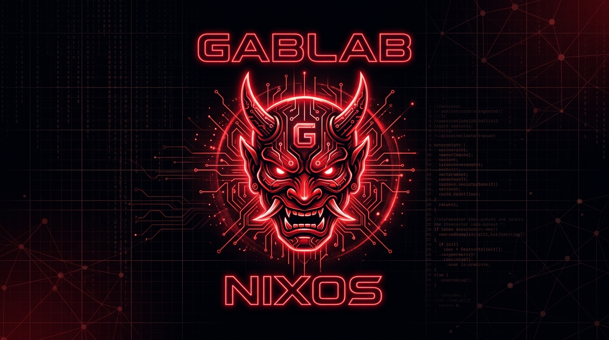

<div align="center">

  

  <br/><br/>

  [](https://nixos.org)
  [](https://nixos.wiki/wiki/Flakes)
  [](https://wireguard.com)
  [](https://caddyserver.com)
  [](#)

  <p align="center">
    <b>Personal Infrastructure as Code (IaC) using Nix Flakes.</b>
  </p>

  <sub><i>"Nix flakes, caffeine and existential dread."</i></sub>

</div>

---

## ⚡ About This Repo

Personal Infrastructure as Code (IaC) managing servers, gateway ingress, and network isolation from a single, fully reproducible **Nix Flake**.

- **Router / Gateway:** Edge gateway handling WireGuard tunnels, strict nftables firewall policies, local DNS resolving, and Caddy ingress with wildcard TLS.
- **Service Nodes:** Dedicated application hosts running isolated workloads without direct WAN exposure.
- **Declarative Secrets:** Encrypted secrets at rest using **Agenix**.
- **Storage Partitioning:** Declarative disk layouts powered by **Disko**.

---

## 🐅 Why Nix?

- **Zero mutable state:** Everything is declared in code; rollbacks are instantaneous.
- **Security & Sandboxing:** Ephemeral unprivileged service users (`DynamicUser`) and hardened firewalls.
- **No drift:** What is in Git is what runs in production.

---

## 🕸️ Architecture

```text
GabLab/
├── assets/                  # Brand assets & banner
├── corns/
│   ├── hosts/               # Machine-specific configurations
│   │   ├── router/          # Ingress gateway, DNS, firewall & VPN
│   │   └── spidernet/       # Isolated services & web workloads
│   └── modules/             # Reusable core modules
│       ├── boot.nix         # Kernel & bootloader definitions
│       ├── disko.nix        # Declarative GPT partition tables
│       ├── network.nix      # Base network parameters
│       └── users.nix        # Immutable user declarations
├── shells/
│   └── nixos.nix            # Reproducible development shell
├── flake.nix                # Flake entrypoint & outputs
└── secrets.nix              # Agenix encryption rules
```

---

## ⚙️ Operations

```bash
# -- Enter the nix development environment
nix develop

# -- Validate and check flake outputs
nix flake check

# -- Deploy remote host
nixos-rebuild switch \
  --flake .#<host> \
  --target-host <host>.gablab \
  --build-host <host>.gablab \
  --sudo --no-reexec
```

---

<div align="center">
  <sub>GabLab Infrastructure © 2026</sub>
</div>
